# 📷 Phone Camera

> Biến điện thoại Android thành **hệ thống camera an ninh nội bộ** — phát và xem luồng RTSP qua WiFi mà không cần internet.
> Stream chỉ hoạt động khi app đang mở trên màn hình.

---

## Mục lục

1. [Tính năng](#1-tính-năng)
2. [Công nghệ](#2-công-nghệ)
3. [Cấu trúc thư mục](#3-cấu-trúc-thư-mục)
4. [Màn hình](#4-màn-hình)
5. [Kiến trúc MVVM](#5-kiến-trúc-mvvm)
6. [Sơ đồ Use Case](#6-sơ-đồ-use-case)
7. [Sơ đồ Lớp](#7-sơ-đồ-lớp)
8. [Sơ đồ Tuần tự](#8-sơ-đồ-tuần-tự)
9. [Giao thức ControlServer](#9-giao-thức-controlserver-tcp-8081)
10. [Vòng đời tài nguyên](#10-vòng-đời-tài-nguyên)
11. [Quyền hệ thống](#11-quyền-hệ-thống)
12. [Luồng khởi động](#12-luồng-khởi-động)
13. [Ghi chú cho developer](#13-ghi-chú-cho-developer)

---

## 1. Tính năng

| Vai trò | Màn hình | Chức năng |
|---|---|---|
| 📹 **Máy Quay** | Streamer | Phát RTSP từ camera điện thoại qua WiFi nội bộ |
| 🖥️ **Màn hình Xem** | Viewer | Xem đồng thời tối đa 4 camera, điều khiển chất lượng từ xa |

**Chi tiết:**
- Tự động phát hiện camera cùng mạng qua **mDNS** (không cần nhập IP thủ công)
- Viewer có thể đổi chất lượng stream (**360p / 720p / 1080p**) của Streamer từ xa
- Streamer hiển thị tên thiết bị đang xem theo thời gian thực
- Chế độ auto-dim màn hình tiết kiệm pin khi dùng làm camera an ninh
- Hỗ trợ cả **TCP** và **UDP** cho RTSP (chuyển đổi từ Viewer)
- ExoPlayer cấu hình low-latency (buffer tối thiểu ~1s)

---

## 2. Công nghệ

| Thành phần | Chi tiết |
|---|---|
| **Ngôn ngữ** | Kotlin |
| **Min SDK** | API 26 (Android 8.0) |
| **UI** | Jetpack Compose + Material 3 |
| **Kiến trúc** | MVVM + Unidirectional Data Flow |
| **State** | `StateFlow` + `collectAsStateWithLifecycle()` |
| **Async** | Kotlin Coroutines (`viewModelScope`, `Dispatchers.IO/Main`) |
| **Phát RTSP** | `RtspServerCamera2` (pedroSG94/RTSP-Server 1.4.1 + RootEncoder 2.7.2) |
| **Xem RTSP** | `Media3 ExoPlayer 1.5.0` với `RtspMediaSource` |
| **Discovery** | `Android NsdManager` (mDNS, service type `_rtspguard._tcp`) |
| **Control** | `ControlServer` — TCP server tự viết trên port 8081 |
| **Lưu trữ** | `DataStore Preferences` + `kotlinx.serialization` (JSON) |
| **Quyền** | `Accompanist Permissions` |
| **Navigation** | `Navigation Compose` |
| **Logging** | `AppLog` — wrapper tập trung, tag `"PhoneCamera"` |

### Design Pattern áp dụng
- **Repository Pattern** — `CameraRepository` ẩn chi tiết DataStore khỏi ViewModel
- **Sealed Class** — `PlayerState`, `ControlServer.Command` mô hình hóa trạng thái an toàn
- **Observer Pattern** — UI subscribe `StateFlow` qua `collectAsStateWithLifecycle()`
- **Custom TCP Protocol** — `ControlServer` nhận lệnh text-based từ Viewer

---

## 3. Cấu trúc thư mục

```
app/src/main/java/com/example/phonecamera/
│
├── MainActivity.kt              # Activity duy nhất, setup NavHost
├── navigation/
│   └── Screen.kt                # sealed class: Home | Streamer | Viewer
│
├── data/
│   ├── CameraRepository.kt      # CameraConfig model + DataStore CRUD
│   └── nsd/
│       ├── NsdHelper.kt         # Đăng ký & khám phá mDNS service
│       └── DiscoveredCamera.kt  # Data class camera tìm được qua NSD
│
├── home/
│   ├── HomeScreen.kt            # Màn hình chọn vai trò
│   └── HomeViewModel.kt         # Quản lý trạng thái quyền
│
├── streamer/
│   ├── StreamerScreen.kt        # UI phát camera (landscape)
│   ├── StreamerViewModel.kt     # Quản lý RtspServerCamera2, ControlServer, NSD
│   └── ControlServer.kt         # TCP server port 8081, nhận lệnh từ Viewer
│
├── viewer/
│   ├── ViewerScreen.kt          # UI xem camera (portrait/landscape/fullscreen)
│   ├── ViewerViewModel.kt       # Quản lý 4 slot, NSD discovery, gửi lệnh TCP
│   └── components/
│       ├── CameraCell.kt        # Ô camera: ExoPlayer + nút điều khiển
│       ├── AddEditCameraDialog.kt
│       └── DiscoveryBottomSheet.kt
│
├── ui/theme/
│   ├── Color.kt                 # Bảng màu Dark/Light + overlay aliases
│   ├── Theme.kt                 # MaterialTheme Dark/Light scheme
│   └── Type.kt                  # Typography
│
└── utils/
    └── AppLog.kt                # Centralized logger
```

---

## 4. Màn hình

### Home Screen
- Luôn **portrait**
- 2 thẻ bấm: **Máy Quay** / **Màn hình Xem**
- Tự động kiểm tra quyền CAMERA + RECORD_AUDIO — thiếu thì disable thẻ Máy Quay

### Streamer Screen
- Tự chuyển **landscape** + ẩn system bar (immersive mode)
- Layout: **65% camera preview** | **35% control panel**
- Control panel bao gồm:
  - Chip chọn độ phân giải (locked khi đang phát, cập nhật khi Viewer đổi từ xa)
  - RTSP URL + nút Copy
  - Card "Đang được xem": hiện tên thiết bị Viewer đang kết nối
  - Nút Bắt đầu / Dừng phát
- Nút lật camera trước/sau
- Auto-dim màn hình sau 30s không tương tác (độ sáng 0.01)
- Badge **LIVE** nhấp nháy khi stream đang chạy
- **Stream tự dừng khi app vào background** (Lifecycle ON_PAUSE)

### Viewer Screen
- **Portrait**: LazyColumn cuộn dọc
- **Landscape**: lưới 2×2 tỉ lệ 16:9
- **Fullscreen**: xem 1 camera toàn màn hình
- Toolbar: nút TCP/UDP toggle, badge đếm camera phát hiện, nút vào landscape
- Mỗi ô camera:
  - Chấm trạng thái (xanh = đang phát, vàng = đang kết nối)
  - FPS badge thực tế + độ phân giải
  - Nút **HD** 🎥 (chỉ với Phone Camera): dropdown 360p / 720p / 1080p → gửi lệnh đổi chất lượng
  - Nút âm thanh, tải lại, toàn màn hình, sửa

---

## 5. Kiến trúc MVVM

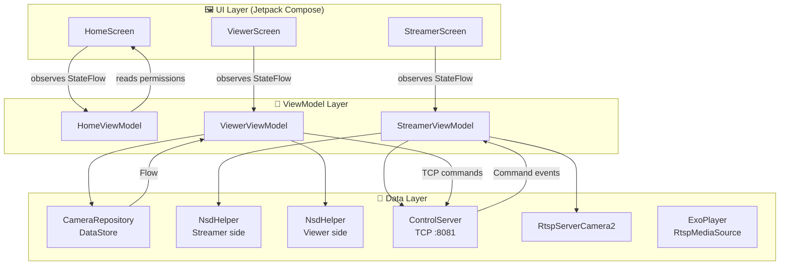

**Quy tắc:**
- `@Composable` chỉ **đọc** StateFlow và **gọi hàm** ViewModel — không tự xử lý logic
- ViewModel giữ `private val _uiState = MutableStateFlow(...)`, expose `val uiState = _uiState.asStateFlow()`
- Mọi side-effect chạy trong `viewModelScope.launch {}`

---

## 6. Sơ đồ Use Case

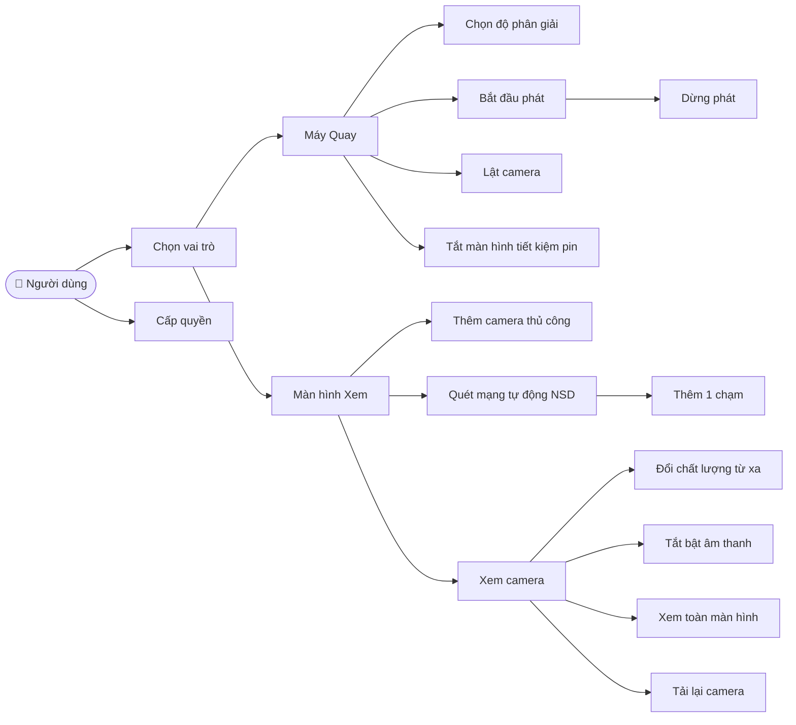

---

## 7. Sơ đồ Lớp

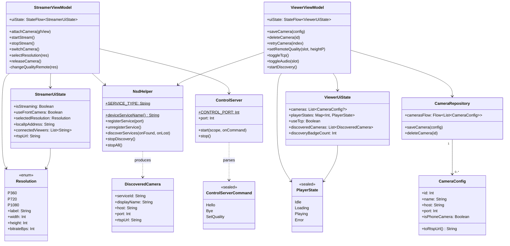

---

## 8. Sơ đồ Tuần tự

### 8.1 Phát Camera (Streamer)

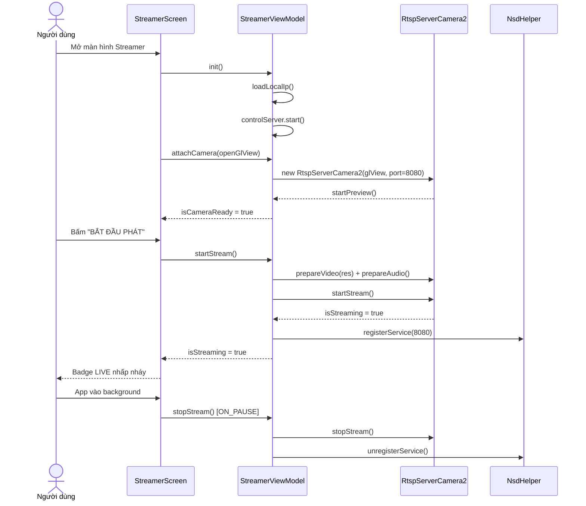

### 8.2 Xem Camera (Viewer)

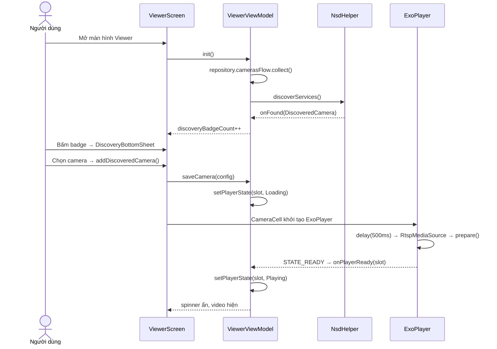

### 8.3 Đổi Chất lượng từ Viewer

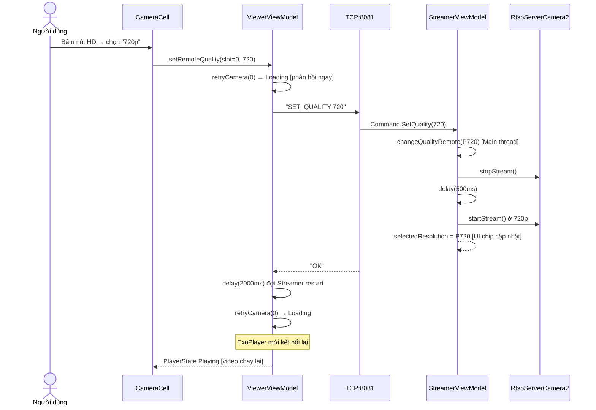

### 8.4 Tracking Viewer (HELLO/BYE)

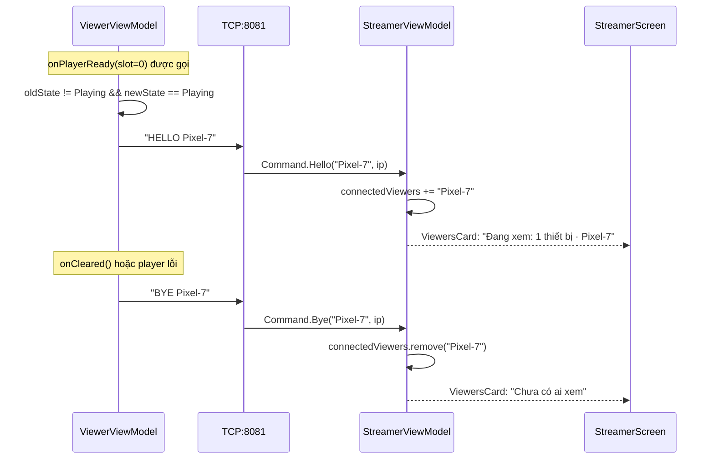

### 8.5 Auto-discovery mDNS

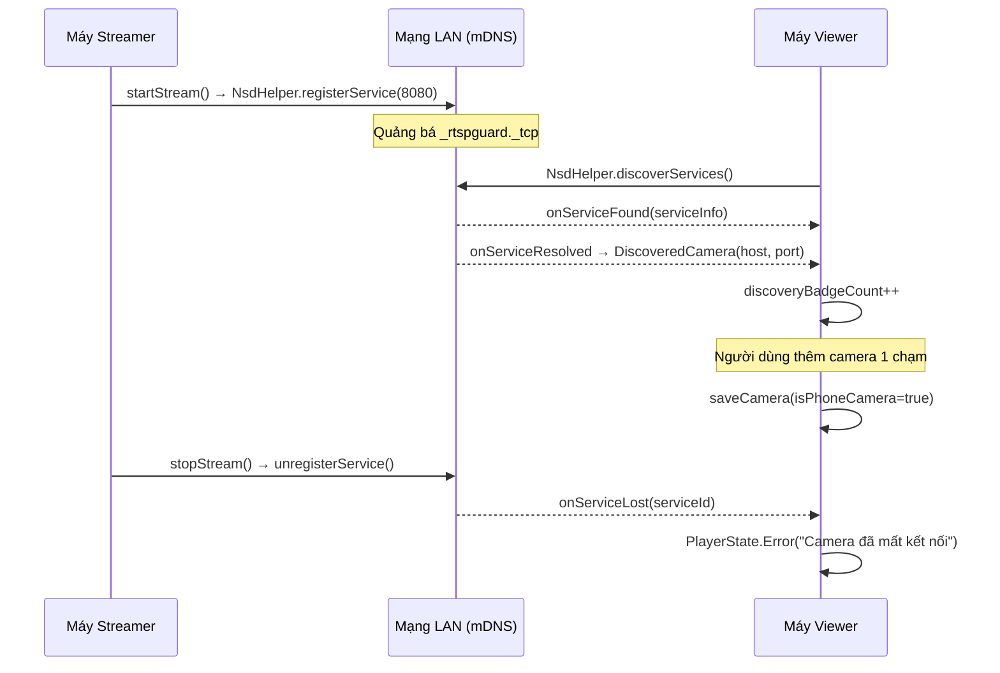

---

## 9. Giao thức ControlServer (TCP :8081)

ControlServer là một TCP server text-based, chạy trên máy Streamer. Mỗi kết nối là một lệnh + response.

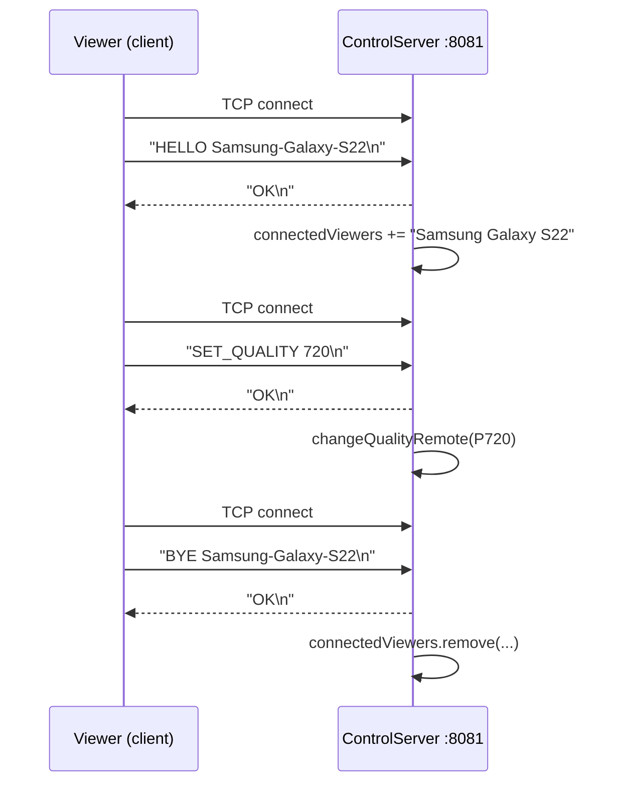

| Lệnh | Format | Ý nghĩa |
|---|---|---|
| HELLO | `HELLO <tên máy>` | Viewer bắt đầu phát stream |
| BYE | `BYE <tên máy>` | Viewer ngừng phát stream |
| SET_QUALITY | `SET_QUALITY <360\|720\|1080>` | Yêu cầu đổi độ phân giải |

Response luôn là `OK` hoặc `ERROR <lý do>`.

---

## 10. Vòng đời Tài nguyên

### StreamerViewModel (Camera + Stream)

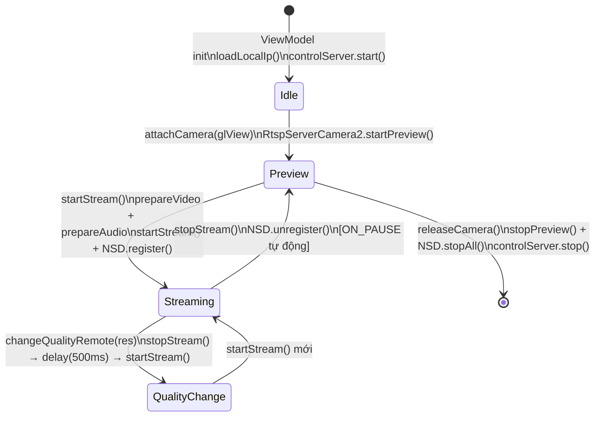

### ExoPlayer trong CameraCell

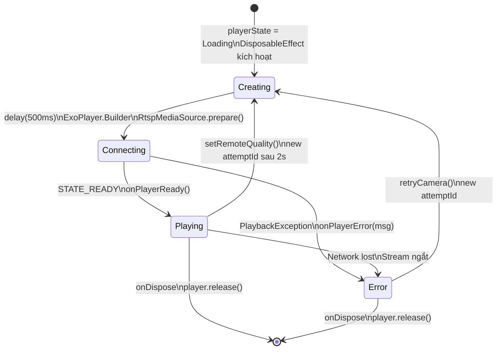

---

## 11. Quyền Hệ thống

| Quyền | Lý do |
|---|---|
| `CAMERA` | Quay video để phát RTSP |
| `RECORD_AUDIO` | Thu âm trong stream |
| `INTERNET` | Kết nối RTSP (:8080) và ControlServer (:8081) |
| `ACCESS_WIFI_STATE` | Đọc địa chỉ IP WiFi hiện tại |
| `CHANGE_WIFI_MULTICAST_STATE` | Nhận gói mDNS multicast để phát hiện camera |

---

## 12. Luồng Khởi động

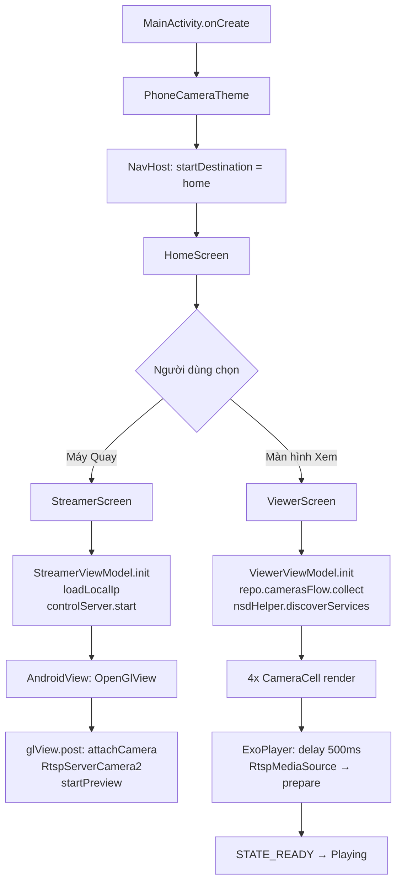

---

## 13. Ghi chú cho Developer

### `isPhoneCamera` flag
Camera thêm qua **NSD auto-discovery** tự động có `isPhoneCamera = true`. Chỉ những camera này:
- Hiển thị nút HD để đổi chất lượng từ xa
- Gửi lệnh HELLO/BYE đến ControlServer

Camera thêm **thủ công** (nhập IP) có `isPhoneCamera = false` — không hỗ trợ điều khiển từ xa.

### Thread Safety
`ControlServer` chạy hoàn toàn trên `Dispatchers.IO`. Mọi callback khi nhận lệnh phải dispatch về Main:
```kotlin
// ĐÚNG
viewModelScope.launch(Dispatchers.Main) {
    _uiState.update { ... }
}

// SAI — StateFlow update từ IO thread
_uiState.update { ... } // có thể gây race condition
```

### StateFlow Pattern
```kotlin
// ViewModel
private val _uiState = MutableStateFlow(MyUiState())
val uiState: StateFlow<MyUiState> = _uiState.asStateFlow()

// UI
val uiState by viewModel.uiState.collectAsStateWithLifecycle()
```
`collectAsStateWithLifecycle()` tự ngừng collect khi app vào background — tiết kiệm pin.

### ExoPlayer Lifecycle
`DisposableEffect(rtspUrl, useTcp, attemptId)` — bất kỳ tham số nào thay đổi → ExoPlayer cũ bị `release()`, player mới tạo. `retryCamera()` tạo `attemptId` mới để trigger restart.

### AppLog
```kotlin
AppLog.d("message")  // Debug
AppLog.i("message")  // Info
AppLog.w("message")  // Warning
AppLog.e("message")  // Error
AppLog.v("message")  // Verbose
```
Filter trong Logcat: `tag:PhoneCamera`

---

*Cập nhật lần cuối: 2026-04-23*
