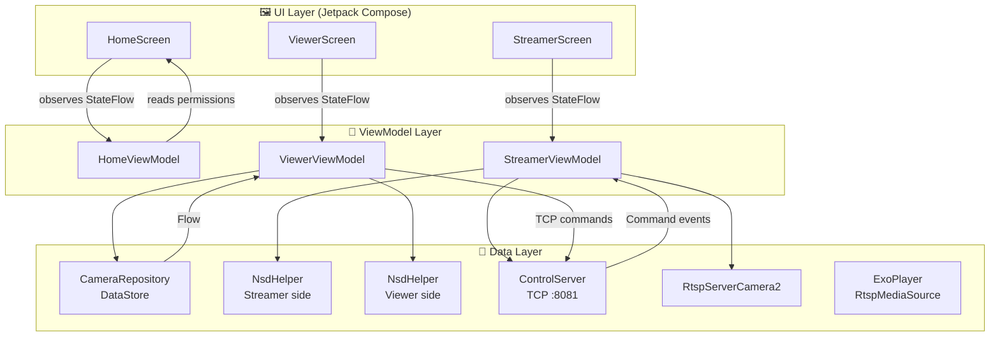
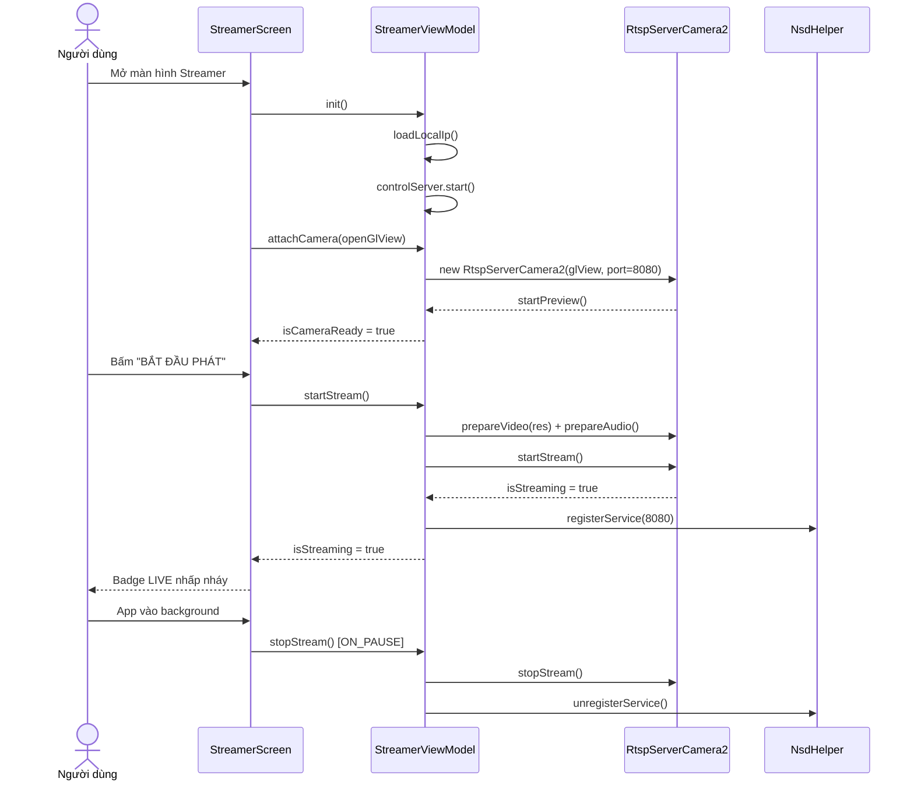
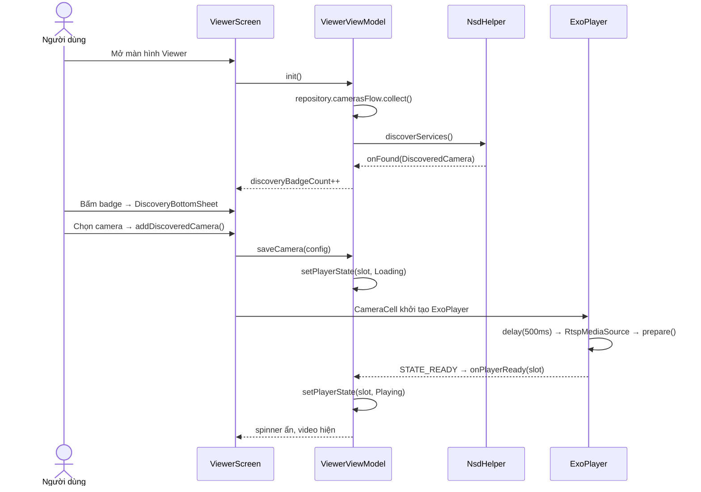
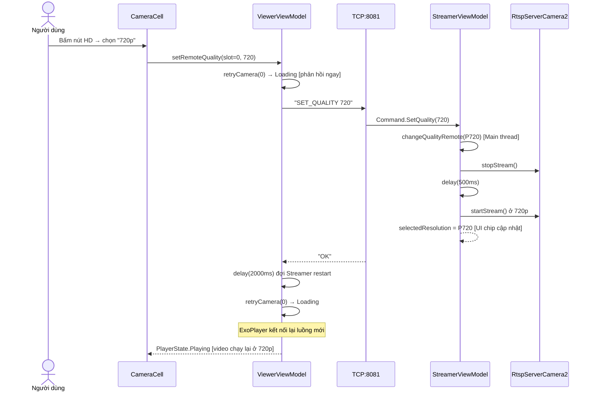
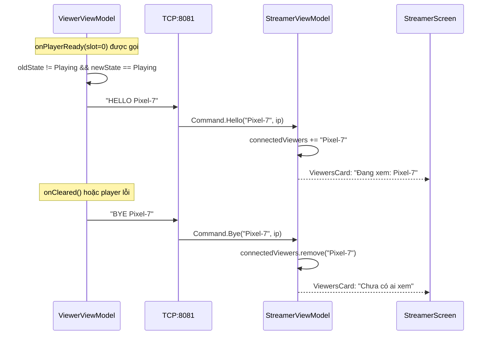

# 📷 Phone Camera - Hệ thống Camera Giám sát Nội bộ Không Dây

> **Biến điện thoại Android thành hệ thống camera an ninh nội bộ thông minh** — phát và xem luồng RTSP chất lượng cao qua mạng WiFi nội bộ (LAN) mà không cần kết nối internet hay máy chủ đám mây trung gian.

Ứng dụng được thiết kế tối ưu hóa cho hiệu năng cao, độ trễ cực thấp (~1s) và khả năng tự động khám phá thiết bị (Zero Configuration) trong cùng mạng WiFi. Đây là một dự án hoàn hảo để chứng minh năng lực về lập trình Android hiện đại (Modern Android Development), xử lý Multimedia (Video Streaming), Networking (TCP/IP socket, mDNS) và Quản lý luồng xử lý bất đồng bộ (Kotlin Coroutines & Flow).

---

## 📌 Mục lục

1. [Các Tính Năng Nổi Bật](#-các-tính-năng-nổi-bật)
2. [Kiến Trúc & Công Nghệ](#-kiến-trúc--công-nghệ)
3. [Thiết Kế Luồng & Sơ Đồ Kiến Trúc](#-thiết-kế-luồng--sơ-đồ-kiến-trúc)
4. [Giao Thức Điều Khiển ControlServer (TCP Port 8081)](#-giao-thức-điều-khuyển-controlserver-tcp-port-8081)
5. [Giải Pháp Tối Ưu Độ Trễ & Xử Lý Frame (Low-Latency Video)](#-giải-pháp-tối-ưu-độ-trễ--xử-lý-frame-low-latency-video)
6. [Cơ Chế Auto-Discovery (mDNS/NSD)](#-cơ-chế-auto-discovery-mdnsnsd)
7. [Quản Lý Vòng Đời & Tránh Rò Rỉ Bộ Nhớ (Memory Leaks)](#-quản-lý-vòng-đời--tránh-rò-rỉ-bộ-nhớ-memory-leaks)
8. [Cấu Trúc Thư Mục Dự Án](#-cấu-trúc-thư-mục-dự-án)
9. [🎓 Bộ Câu Hỏi Phỏng Vấn "Trúng Tủ" (Interview Cheat Sheet)](#-bộ-câu-hỏi-phỏng-vấn-trúng-tủ-interview-cheat-sheet)
10. [Hướng Dẫn Cài Đặt & Chạy Thử](#-hướng-dẫn-cài-đặt--chạy-thử)

---

## ⚡ Các Tính Năng Nổi Bật

| Vai trò | Giao diện | Chức năng chi tiết & Công nghệ cốt lõi |
|---|---|---|
| 📹 **Máy Quay** (Streamer) | Landscape, Immersive | - Phát trực tiếp luồng RTSP (H.264/AAC) sử dụng Camera2 API.<br>- Tự động hạ độ sáng màn hình (Auto-dim) về mức tối thiểu sau 30s không tương tác để tiết kiệm pin & chống chai màn hình.<br>- Hiển thị số lượng và tên thiết bị đang xem stream theo thời gian thực.<br>- Thay đổi nóng camera trước/sau.<br>- Hỗ trợ chuyển đổi nhanh hoặc nhận lệnh đổi độ phân giải từ xa (360p, 720p, 1080p). |
| 🖥️ **Màn hình Xem** (Viewer) | Grid 2×2, Fullscreen | - Hỗ trợ xem đồng thời tối đa 4 camera theo lưới thời gian thực.<br>- Tự động dò tìm camera đang phát cùng mạng LAN thông qua mDNS (Zero-configuration).<br>- Điều khiển chất lượng luồng phát của camera đích từ xa bằng custom TCP protocol.<br>- Hỗ trợ đo lường FPS thực tế (actual FPS) hiển thị trên từng ô phát.<br>- Chuyển đổi linh hoạt giữa giao thức vận chuyển RTSP (TCP / UDP).<br>- Quản lý lưu trữ thông tin camera lưu động qua Jetpack DataStore. |

---

## 🛠️ Kiến Trúc & Công Nghệ

Dự án áp dụng chặt chẽ các nguyên lý của **Modern Android Development (MAD)**:

### 1. Technology Stack
*   **UI Layer:** Jetpack Compose kết hợp với Material 3, tối ưu thiết kế phản hồi (Responsive Grid), hỗ trợ cả chế độ Portrait và Landscape.
*   **Architecture:** MVVM (Model-View-ViewModel) kết hợp với mô hình dòng dữ liệu một chiều **Unidirectional Data Flow (UDF)**.
*   **Reactive Programming:** Sử dụng Kotlin Coroutines để xử lý tác vụ nền nặng (TCP Server, NSD Discovery) kết hợp với `StateFlow` và `collectAsStateWithLifecycle()` nhằm quan sát trạng thái của ứng dụng an toàn theo vòng đời UI.
*   **Media Streaming:**
    *   *Streamer:* Tích hợp thư viện `RootEncoder` (dựa trên `pedroSG94/RTSP-Server`) thực hiện mã hóa phần cứng phần cứng (H.264/AAC) và cung cấp RTSP Server trực tiếp trên điện thoại.
    *   *Viewer:* Sử dụng `Jetpack Media3 ExoPlayer` với module mở rộng `RtspMediaSource`.
*   **Data Persistence:** `Jetpack DataStore Preferences` lưu trữ danh sách cấu hình camera dưới định dạng JSON (sử dụng `kotlinx.serialization`).
*   **Network Discovery:** Android `NsdManager` (Network Service Discovery) phục vụ cơ chế mDNS tự khám phá dịch vụ ở port `:8080` (Service type: `_rtspguard._tcp`).

### 2. Design Patterns Áp Dụng
*   **Repository Pattern:** Lớp `CameraRepository` bao bọc lấy Jetpack DataStore để cung cấp luồng dữ liệu (`Flow<List<CameraConfig>>`) giúp giữ code sạch và phân chia tầng lớp dữ liệu rõ ràng.
*   **Sealed Class / Sealed Interface State:** Mô hình hóa các trạng thái bất định như trạng thái Player (`PlayerState: Idle, Loading, Playing, Error`) và các lệnh điều khiển (`ControlServer.Command`).
*   **Observer Pattern:** Giao diện đăng ký nhận các biến đổi dữ liệu thông qua StateFlow của Viewmodel.

---

## 📐 Thiết Kế Luồng & Sơ Đồ Kiến Trúc

### 1. Sơ đồ Kiến trúc MVVM & Data Flow


```mermaid
graph TD
    subgraph UI["🖼️ UI Layer (Jetpack Compose)"]
        HS[HomeScreen]
        SS[StreamerScreen]
        VS[ViewerScreen]
    end

    subgraph VM["🧠 ViewModel Layer"]
        HVM[HomeViewModel]
        SVM[StreamerViewModel]
        VVM[ViewerViewModel]
    end

    subgraph DATA["💾 Data Layer"]
        REPO[CameraRepository\nDataStore]
        NSD1[NsdHelper\nStreamer side]
        NSD2[NsdHelper\nViewer side]
        CS[ControlServer\nTCP :8081]
        RTSP[RtspServerCamera2]
        EXO[ExoPlayer\nRtspMediaSource]
    end

    HS -->|observes StateFlow| HVM
    SS -->|observes StateFlow| SVM
    VS -->|observes StateFlow| VVM

    HVM -->|reads permissions| HS

    SVM --> RTSP
    SVM --> NSD1
    SVM --> CS

    VVM --> REPO
    VVM --> NSD2
    VVM -->|TCP commands| CS

    REPO -->|Flow| VVM
    CS -->|Command events| SVM
```

---

### 2. Sơ đồ Tuần tự (Sequence Diagrams)

#### A. Luồng Đăng Ký & Phát Camera (Streamer)
Khi người dùng bật phát camera, hệ thống khởi tạo máy chủ RTSP nội bộ và truyền tải thông tin qua mDNS LAN.


```mermaid
sequenceDiagram
    actor U as Người dùng
    participant SS as StreamerScreen
    participant SVM as StreamerViewModel
    participant CAM as RtspServerCamera2
    participant NSD as NsdHelper

    U->>SS: Mở màn hình Streamer
    SS->>SVM: init()
    SVM->>SVM: loadLocalIp()
    SVM->>SVM: controlServer.start()

    SS->>SVM: attachCamera(openGlView)
    SVM->>CAM: new RtspServerCamera2(glView, port=8080)
    CAM-->>SVM: startPreview()
    SVM-->>SS: isCameraReady = true

    U->>SS: Bấm "BẮT ĐẦU PHÁT"
    SS->>SVM: startStream()
    SVM->>CAM: prepareVideo(res) + prepareAudio()
    SVM->>CAM: startStream()
    CAM-->>SVM: isStreaming = true
    SVM->>NSD: registerService(8080)
    SVM-->>SS: isStreaming = true
    SS-->>U: Badge LIVE nhấp nháy

    U->>SS: App vào background
    SS->>SVM: stopStream() [ON_PAUSE]
    SVM->>CAM: stopStream()
    SVM->>NSD: unregisterService()
```

#### B. Luồng Tự Khám Phá & Kết Nối (Viewer)
Thiết bị Viewer quét mạng cục bộ để nhận diện các địa chỉ IP của Streamer mà không cần nhập thủ công.


```mermaid
sequenceDiagram
    actor U as Người dùng
    participant VS as ViewerScreen
    participant VVM as ViewerViewModel
    participant NSD as NsdHelper
    participant EXO as ExoPlayer

    U->>VS: Mở màn hình Viewer
    VS->>VVM: init()
    VVM->>VVM: repository.camerasFlow.collect()
    VVM->>NSD: discoverServices()

    NSD-->>VVM: onFound(DiscoveredCamera)
    VVM-->>VS: discoveryBadgeCount++

    U->>VS: Bấm badge → DiscoveryBottomSheet
    U->>VS: Chọn camera → addDiscoveredCamera()
    VS->>VVM: saveCamera(config)
    VVM->>VVM: setPlayerState(slot, Loading)
    VS->>EXO: CameraCell khởi tạo ExoPlayer

    EXO->>EXO: delay(500ms) → RtspMediaSource → prepare()
    EXO-->>VVM: STATE_READY → onPlayerReady(slot)
    VVM->>VVM: setPlayerState(slot, Playing)
    VVM-->>VS: spinner ẩn, video hiện
```

#### C. Thay Đổi Chất Lượng Stream Từ Xa (Remote Quality Change)
Luồng tương tác phức tạp nhất: Viewer gửi yêu cầu đổi độ phân giải qua TCP, Streamer khởi tạo lại encoder, sau đó Viewer đồng bộ hóa lại Player.


```mermaid
sequenceDiagram
    actor U as Người dùng
    participant CC as CameraCell
    participant VVM as ViewerViewModel
    participant TCP as TCP:8081
    participant SVM as StreamerViewModel
    participant CAM as RtspServerCamera2

    U->>CC: Bấm nút HD → chọn "720p"
    CC->>VVM: setRemoteQuality(slot=0, 720)
    VVM->>VVM: retryCamera(0) → Loading [phản hồi ngay]

    VVM->>TCP: "SET_QUALITY 720"
    TCP->>SVM: Command.SetQuality(720)
    SVM->>SVM: changeQualityRemote(P720) [Main thread]
    SVM->>CAM: stopStream()
    SVM->>SVM: delay(500ms)
    SVM->>CAM: startStream() ở 720p
    SVM-->>SVM: selectedResolution = P720 [UI chip cập nhật]
    TCP-->>VVM: "OK"

    VVM->>VVM: delay(2000ms) đợi Streamer restart
    VVM->>VVM: retryCamera(0) → Loading
    Note over VVM: ExoPlayer kết nối lại luồng mới
    VVM-->>CC: PlayerState.Playing [video chạy lại ở 720p]
```

#### D. Quản lý trạng thái trực tuyến (HELLO/BYE tracking)
Streamer biết được Viewer nào đang kết nối và hiển thị lên màn hình thông qua các thông điệp chào mừng và tạm biệt.


```mermaid
sequenceDiagram
    participant VVM as ViewerViewModel
    participant TCP as TCP:8081
    participant SVM as StreamerViewModel
    participant SS as StreamerScreen

    Note over VVM: onPlayerReady(slot=0) được gọi
    VVM->>VVM: oldState != Playing && newState == Playing
    VVM->>TCP: "HELLO Pixel-7"
    TCP->>SVM: Command.Hello("Pixel-7", ip)
    SVM->>SVM: connectedViewers += "Pixel-7"
    SVM-->>SS: ViewersCard: "Đang xem: Pixel-7"

    Note over VVM: onCleared() hoặc player lỗi
    VVM->>TCP: "BYE Pixel-7"
    TCP->>SVM: Command.Bye("Pixel-7", ip)
    SVM->>SVM: connectedViewers.remove("Pixel-7")
    SVM-->>SS: ViewersCard: "Chưa có ai xem"
```

---

## 📡 Giao Thức Điều Khiển ControlServer (TCP Port 8081)

Để hỗ trợ giao tiếp hai chiều giữa Viewer và Streamer (vốn giao thức RTSP thuần túy không hỗ trợ tốt các lệnh điều khiển tùy biến), dự án triển khai một **Custom TCP Server** chạy độc lập trên cổng `8081` tại phía Streamer.

### 1. Định Dạng Giao Thức (Text-Based Protocol)
Mỗi phiên kết nối gửi một chuỗi văn bản kết thúc bằng ký tự xuống dòng (`\n`). 
*   **HELLO `<tên thiết bị>`**: Viewer thông báo đã bắt đầu xem thành công.
    *   *Mục đích:* Streamer hiển thị danh sách thiết bị đang xem trực tiếp để chủ sở hữu nhận biết được bảo mật thông tin.
*   **BYE `<tên thiết bị>`**: Viewer thông báo ngừng xem (khi thoát màn hình hoặc tắt ứng dụng).
    *   *Mục đích:* Giải phóng danh sách kết nối tại máy Streamer.
*   **SET_QUALITY `<360|720|1080>`**: Viewer yêu cầu thay đổi độ phân giải.
    *   *Mục đích:* Ra lệnh cho Streamer tắt stream hiện tại, thay đổi cấu hình mã hóa phần cứng của camera và tái khởi động stream mới ở chất lượng được yêu cầu.

### 2. Định Dạng Phản Hồi (Responses)
Server luôn trả về một phản hồi kết thúc bằng `\n` sau khi phân tích lệnh:
*   `OK`: Lệnh được chấp nhận và thực thi thành công.
*   `ERROR <lý do>`: Không nhận dạng được lệnh hoặc có lỗi xảy ra trong quá trình thực thi.

---

## 🎥 Giải Pháp Tối Ưu Độ Trễ & Xử Lý Frame (Low-Latency Video)

Trong các ứng dụng giám sát an ninh, độ trễ truyền dữ liệu video (latency) là yếu tố sống còn. Để đạt độ trễ tiệm cận thời gian thực (~1 giây) qua mạng LAN, dự án triển khai các cấu hình kỹ thuật sau:

### 1. Tối Ưu Bộ Đệm ExoPlayer (Custom LoadControl)
Mặc định, ExoPlayer cấu hình bộ đệm lớn (khoảng 15s đến 50s) nhằm đảm bảo video phát mượt mà qua các mạng internet không ổn định. Tuy nhiên, cấu hình này sẽ làm tăng độ trễ rất cao đối với RTSP nội bộ. Chúng tôi tùy chỉnh cấu hình `DefaultLoadControl` trong `CameraCell.kt`:

```kotlin
val loadControl = DefaultLoadControl.Builder()
    // minBufferMs, maxBufferMs, bufferForPlaybackMs, bufferForPlaybackAfterRebufferMs
    .setBufferDurationsMs(1000, 5000, 500, 1000)
    .setPrioritizeTimeOverSizeThresholds(true)
    .build()
```
*   `minBufferMs` = 1000: Chỉ cần đệm tối thiểu 1 giây video là player có thể bắt đầu giải mã.
*   `maxBufferMs` = 5000: Không đệm quá 5 giây để giảm tiêu thụ bộ nhớ và tránh tích lũy độ trễ.
*   `bufferForPlaybackMs` = 500: Chỉ cần 0.5s đệm là bắt đầu phát, giảm thời gian xoay spinner.
*   `prioritizeTimeOverSizeThresholds` = true: Ưu tiên thời lượng đệm thay vì dung lượng đệm.

### 2. Hỗ Trợ Giao Thức Chuyển Chở UDP và TCP
*   **UDP:** Mặc định được bật để đạt tốc độ tối đa và độ trễ thấp nhất. Nếu gặp hiện tượng mất gói tin làm nhiễu hình hoặc vỡ hình, Viewer có thể chuyển đổi thủ công sang chế độ **TCP Interleaved** để đảm bảo tính toàn vẹn của gói tin qua bộ lọc `setForceUseRtpTcp(useTcp)`.

### 3. Tính Toán FPS Thực Tế Bằng Metadata Listener
Không sử dụng các chỉ số giả lập, ứng dụng trực tiếp đo lường số lượng khung hình (Frame) thực tế được vẽ trên Surface thông qua `VideoFrameMetadataListener`:
```kotlin
val listener = VideoFrameMetadataListener { _, _, format, _ ->
    frameCounter.incrementAndGet()
    if (videoInfo.isEmpty()) videoInfo = "${format.width}x${format.height}"
}
exoPlayer?.setVideoFrameMetadataListener(listener)
```
Mỗi giây, một đồng hồ Coroutine sẽ đọc giá trị `frameCounter`, cập nhật FPS lên UI và reset bộ đếm về 0, cung cấp thông số băng thông trực quan cho lập trình viên.

---

## 🔍 Cơ Chế Auto-Discovery (mDNS/NSD)

Ứng dụng không yêu cầu người dùng cấu hình thủ công địa chỉ IP phức tạp nhờ tích hợp giải pháp **Network Service Discovery (NSD)** của Android.

1.  **Đăng ký Dịch vụ (Streamer):**
    Khi Streamer bắt đầu phát sóng luồng RTSP ở port `8080`, hệ thống sử dụng `NsdManager` để đăng ký dịch vụ với định danh:
    *   *Service Name:* `"PhoneCamera_" + DeviceName`
    *   *Service Type:* `"_rtspguard._tcp"`
    *   *Port:* `8080`
2.  **Dò Tìm Dịch vụ (Viewer):**
    Viewer liên tục chạy tiến trình quét mạng (`discoverServices()`) cho loại dịch vụ `_rtspguard._tcp`. Khi phát hiện thấy thiết bị tương thích, `NsdManager` sẽ thực hiện phân giải (Resolve) IP và Port của Streamer, hiển thị thông báo kết nối nhanh (Badge count) cho người dùng.

---

## 💾 Quản Lý Vòng Đời & Tránh Rò Rỉ Bộ Nhớ (Memory Leaks)

Các thư viện Media như ExoPlayer và RtspServerCamera2 có khả năng gây rò rỉ bộ nhớ (memory leaks) rất lớn nếu không được giải phóng đúng cách khi UI bị hủy. Ứng dụng xử lý vấn đề này triệt để bằng cách:

1.  **Sử dụng `DisposableEffect` trong Jetpack Compose:**
    Trong màn hình xem camera, các đối tượng ExoPlayer được quản lý bên trong `DisposableEffect`. Khi ô Camera bị ẩn, hoặc luồng RTSP URL thay đổi, khối lệnh `onDispose` sẽ lập tức giải phóng tài nguyên hệ thống:
    ```kotlin
    DisposableEffect(rtspUrl, useTcp, attemptId) {
        // Khởi tạo ExoPlayer bất đồng bộ sau 500ms
        ...
        onDispose {
            job.cancel()
            player?.release()
            exoPlayer = null
        }
    }
    ```
2.  **Tự động dừng phát ở Background:**
    Nhằm bảo mật quyền riêng tư và tiết kiệm tài nguyên năng lượng, Streamer tự lắng nghe vòng đời ứng dụng. Khi ứng dụng đi vào trạng thái `ON_PAUSE` (người dùng bấm Home hoặc có cuộc gọi đến), hệ thống tự động tắt camera phần cứng, dừng stream và gỡ bỏ NSD Service.

---

## 📁 Cấu Trúc Thư Mục Dự Án

```
app/src/main/java/com/example/phonecamera/
│
├── MainActivity.kt              # Single Activity duy nhất quản lý Composable NavHost
│
├── navigation/
│   └── Screen.kt                # sealed class định nghĩa các Route: Home | Streamer | Viewer
│
├── data/
│   ├── CameraRepository.kt      # Quản lý DataStore Preferences, đọc/ghi danh sách camera lưu trữ
│   ├── CameraConfig.kt          # Thực thể cấu hình camera (id, name, host, port, isPhoneCamera)
│   └── nsd/
│       ├── NsdHelper.kt         # Lớp wrapper xử lý đăng ký và khám phá mDNS Service
│       └── DiscoveredCamera.kt  # Thực thể chứa thông tin camera tìm được qua NSD
│
├── home/
│   ├── HomeScreen.kt            # Màn hình điều hướng chính (lựa chọn vai trò)
│   └── HomeViewModel.kt         # Quản lý kiểm tra và yêu cầu cấp quyền hệ thống
│
├── streamer/
│   ├── StreamerScreen.kt        # UI Streamer: điều khiển phát, lật camera, thông tin kết nối
│   ├── StreamerViewModel.kt     # Quản lý camera phần cứng, điều phối RtspServer và ControlServer
│   └── ControlServer.kt         # TCP Server lắng nghe lệnh điều khiển chất lượng và thiết bị kết nối
│
├── viewer/
│   ├── ViewerScreen.kt          # UI lưới đa camera, tự động chuyển layout dọc/ngang
│   ├── ViewerViewModel.kt       # Quản lý các luồng phát ExoPlayer, gửi lệnh TCP và nhận dạng NSD
│   └── components/
│       ├── CameraCell.kt        # Ô chứa ExoPlayer, xử lý đo FPS thực tế và nút thay đổi HD
│       ├── AddEditCameraDialog.kt
│       └── DiscoveryBottomSheet.kt
│
└── utils/
    └── AppLog.kt                # Hệ thống Logging tập trung với Tag đồng nhất "PhoneCamera"
```

---

## 🎓 Bộ Câu Hỏi Phỏng Vấn "Trúng Tủ" (Interview Cheat Sheet)

Khi mang dự án này đi phỏng vấn vị trí **Android Developer (Kotlin/Native)**, nhà tuyển dụng có thể sẽ hỏi bạn các câu hỏi đào sâu về kỹ thuật dưới đây. Hãy tham khảo cách trả lời chuẩn chỉ để gây ấn tượng mạnh:

### 1. Tại sao bạn lại chọn giao thức TCP cho ControlServer thay vì HTTP hay WebSockets?
*   **Trả lời:** 
    > "Trong phạm vi ứng dụng nội bộ (mạng LAN), việc dựng một HTTP Server (như Ktor hay NanoHTTPD) sẽ tạo thêm nhiều thư viện rác và làm tăng kích thước file APK một cách không cần thiết. WebSockets cũng yêu cầu phải thực hiện bắt tay (handshake) phức tạp và duy trì kết nối liên tục (persistent connection), tiêu tốn nhiều tài nguyên pin. 
    > Vì vậy, em đã tự viết một giao thức text-based tối giản trên socket TCP thô (`ServerSocket` ở cổng `8081`). Mỗi khi Viewer muốn gửi lệnh (như HELLO, BYE, hay đổi chất lượng), nó chỉ cần tạo một kết nối Socket ngắn hạn, gửi 1 dòng lệnh rồi đóng kết nối lại. Giải pháp này cực kỳ nhẹ, nhanh và không làm rò rỉ kết nối."

### 2. Làm thế nào bạn giải quyết bài toán độ trễ (latency) khi phát trực tiếp?
*   **Trả lời:**
    > "Mặc định, ExoPlayer được thiết kế để đệm (buffer) rất nhiều giây trước khi phát nhằm tránh giật hình khi mạng internet yếu. Với luồng RTSP nội bộ, em đã tối ưu hóa điều này bằng cách tùy biến `DefaultLoadControl`. Em cấu hình lại các thông số đệm xuống mức cực thấp: đệm tối thiểu 1000ms để bắt đầu phát và đệm tối đa 5000ms để tránh dồn ứ khung hình. 
    > Đồng thời, em cũng hỗ trợ người dùng toggle giữa giao thức UDP (giảm tối đa độ trễ nhờ bỏ qua kiểm tra bắt tay) và TCP (khi mạng nhiễu nặng)."

### 3. Bạn đã xử lý Thread Safety như thế nào khi nhận lệnh TCP và cập nhật UI State?
*   **Trả lời:**
    > "TCP Server (`ControlServer`) lắng nghe các kết nối đến trên một luồng nền tách biệt nhờ Coroutine sử dụng `Dispatchers.IO` để không gây nghẽn UI (Main Thread). Tuy nhiên, khi nhận được lệnh điều khiển (như yêu cầu đổi độ phân giải), ta bắt buộc phải thay đổi trạng thái của ViewModel và cập nhật UI.
    > Để đảm bảo an toàn luồng (Thread Safety), em đã gom các lệnh nhận được và chuyển tiếp chúng về luồng Main Thread bằng cách chạy trong phạm vi `viewModelScope.launch(Dispatchers.Main)` trước khi thực hiện thay đổi giá trị của `MutableStateFlow` (sử dụng hàm `.update { ... }` nguyên tử). Điều này giúp tránh hiện tượng Race Condition gây crash ứng dụng."

### 4. Jetpack Compose recomposition diễn ra liên tục. Làm sao bạn đảm bảo đối tượng ExoPlayer không bị khởi tạo lại vô tội vạ?
*   **Trả lời:**
    > "Em sử dụng hàm `rememberLowLatencyExoPlayer` kết hợp với `DisposableEffect`. ExoPlayer sẽ chỉ được khởi tạo lại khi và chỉ khi các tham số quan trọng thay đổi (địa chỉ `rtspUrl`, chế độ `useTcp`, hoặc một biến đánh dấu lần thử lại `attemptId`).
    > Khi xảy ra quá trình Recomposition thông thường (ví dụ: thay đổi văn bản hiển thị trên UI), các tham số trên không thay đổi, vì thế Compose sẽ tái sử dụng thực thể Player cũ đã được ghi nhớ. Khi Composable bị hủy hoàn toàn hoặc tham số thay đổi, khối `onDispose` sẽ được kích hoạt để giải phóng (`player.release()`) đối tượng cũ nhằm tránh rò rỉ bộ nhớ."

### 5. Tại sao bạn chọn lưu trữ danh sách Camera bằng Jetpack DataStore Preferences thay vì Room Database?
*   **Trả lời:**
    > "Ứng dụng này chỉ quản lý tối đa 4 slot camera với cấu hình dữ liệu dạng phẳng rất đơn giản (không có các mối quan hệ phức tạp như 1-nhiều hay nhiều-nhiều). Việc tích hợp Room Database trong trường hợp này là quá mức cần thiết (overkill), yêu cầu nhiều cấu hình Boilerplate code (Entity, DAO, Database Class, Migrations).
    > Sử dụng Jetpack DataStore Preferences kết hợp thư viện `kotlinx.serialization` giúp em lưu trữ danh sách camera dưới dạng một chuỗi JSON an toàn, đọc ghi bất đồng bộ thông qua Kotlin Flow, vừa gọn nhẹ vừa đảm bảo hiệu năng cao mà không gây nghẽn luồng UI."

---

## 🚀 Hướng Dẫn Cài Đặt & Chạy Thử

### 1. Yêu cầu thiết bị
*   Tối thiểu 2 thiết bị Android chạy hệ điều hành Android 8.0 (API Level 26) trở lên.
*   Cả hai thiết bị cùng kết nối vào **một mạng WiFi chung**.

### 2. Các bước cài đặt
1.  Clone dự án về máy:
    ```bash
    git clone https://github.com/nvdung1607/PhoneCamera.git
    ```
2.  Mở dự án bằng **Android Studio (Ladybug hoặc mới hơn)**.
3.  Kết nối thiết bị Android của bạn và nhấn **Run app** (`Shift + F10`).

### 3. Cách kiểm thử tính năng
1.  **Trên thiết bị làm Máy Quay (Streamer):**
    *   Mở app, chọn **Máy Quay**.
    *   Cấp quyền Camera và Microphone nếu được yêu cầu.
    *   Chọn độ phân giải mong muốn và bấm **BẮT ĐẦU PHÁT**.
2.  **Trên thiết bị làm Màn hình Xem (Viewer):**
    *   Mở app, chọn **Màn hình Xem**.
    *   Bấm vào biểu tượng quét thiết bị ở góc trên bên phải. Hệ thống sẽ tự quét mDNS và hiển thị tên thiết bị Máy Quay.
    *   Chạm vào tên thiết bị Máy Quay để gán vào một trong bốn ô xem của màn hình lưới. Luồng video trực tiếp sẽ hiển thị sau khoảng 1-2 giây.
    *   Bấm vào nút **HD** trên ô camera để đổi độ phân giải từ xa và kiểm tra phản hồi của Streamer.

---

*Cập nhật lần cuối: 2026-05-26*
