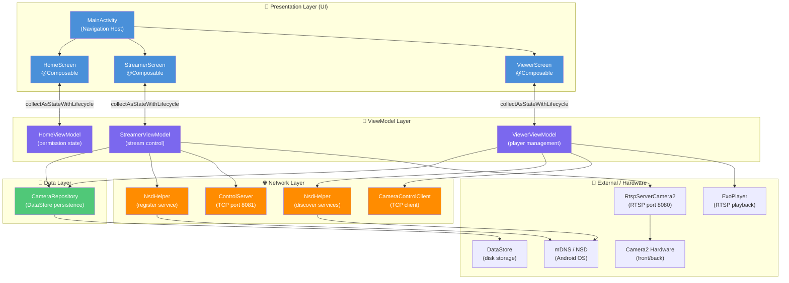
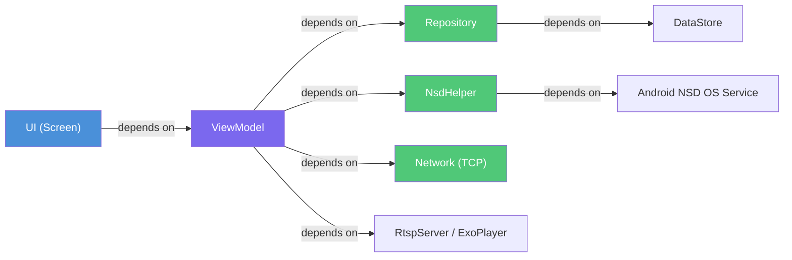

# 🏗️ Architecture Diagram — PhoneCamera

## Kiến trúc tổng thể

Project tuân theo **MVVM (Model-View-ViewModel)** kết hợp **Repository Pattern**, chia thành 3 layer rõ ràng.

---

## Architecture Overview Diagram



---

## Layer-by-Layer Breakdown

### 1. Presentation Layer (UI)

**Công nghệ**: Jetpack Compose

| Component | File | Vai trò |
|-----------|------|---------|
| `MainActivity` | `MainActivity.kt` | Single Activity — setup `NavHost`, giữ toàn bộ app trong 1 Activity |
| `HomeScreen` | `HomeScreen.kt` | Màn hình chọn vai trò (Streamer / Viewer), xin permissions |
| `StreamerScreen` | `StreamerScreen.kt` | UI full-screen phát camera — camera preview 65%, control panel 35% |
| `ViewerScreen` | `ViewerScreen.kt` | UI xem camera — grid 4 slot, discovery panel |

**Pattern**: Mỗi Screen nhận ViewModel qua `viewModel()` composable, observe state qua `collectAsStateWithLifecycle()`, và gửi event qua ViewModel methods.

```kotlin
// Cách Screen và ViewModel kết nối
val uiState by viewModel.uiState.collectAsStateWithLifecycle()
// UI tự recompose khi uiState thay đổi
```

### 2. ViewModel Layer

**Công nghệ**: AndroidViewModel + StateFlow + Coroutines

| ViewModel | UiState | Vai trò chính |
|-----------|---------|---------------|
| `HomeViewModel` | `HomeUiState` | Track camera/audio permission state |
| `StreamerViewModel` | `StreamerUiState` | Quản lý RTSP server, NSD registration, ControlServer |
| `ViewerViewModel` | `ViewerUiState` | Quản lý 4 ExoPlayer instances, NSD discovery, remote control |

**Pattern**: State được tập trung trong `MutableStateFlow`, chỉ ViewModel mới modify được. UI chỉ đọc `StateFlow` (immutable).

```kotlin
private val _uiState = MutableStateFlow(StreamerUiState())
val uiState: StateFlow<StreamerUiState> = _uiState.asStateFlow() // UI nhận cái này
// Chỉ trong ViewModel mới gọi:
_uiState.update { it.copy(isStreaming = true) }
```

### 3. Data Layer

**Công nghệ**: DataStore, NsdManager (Android), TCP Sockets

| Component | Package | Vai trò |
|-----------|---------|---------|
| `CameraRepository` | `data/` | Single source of truth cho danh sách camera — đọc/ghi DataStore |
| `NsdHelper` | `network/` | Wrapper NsdManager — register service (Streamer) và discover services (Viewer) |
| `ControlServer` | `network/` | TCP server trên port 8081 — nhận text commands từ Viewer |
| `CameraControlClient` | `network/` | TCP client — gửi commands HELLO/BYE/SET_QUALITY/SET_FPS đến Streamer |

---

## Dependency Direction



> **Dependency Rule**: Các mũi tên chỉ đi một chiều — UI không biết gì về Repository, Repository không biết gì về ViewModel. Đây là Clean Architecture principle.

---

## Tại sao chọn MVVM?

| Vấn đề | Giải pháp MVVM |
|--------|----------------|
| Android Activity bị kill khi xoay màn hình | ViewModel tồn tại qua config changes |
| Logic camera lẫn với UI code | Tách ra ViewModel |
| Test khó khi logic trong Activity | ViewModel có thể test độc lập |
| Multiple observers cùng 1 state | StateFlow broadcast đến nhiều collector |
