# 📐 Class Diagram (UML) — PhoneCamera

## Toàn bộ Class Relationships

```mermaid
classDiagram
    direction TB

    %% ─── Navigation ────────────────────────────────────────────
    class Screen {
        <<sealed interface>>
    }
    class Screen_Home {
        <<data object>>
    }
    class Screen_Streamer {
        <<data object>>
    }
    class Screen_Viewer {
        <<data object>>
    }
    Screen <|.. Screen_Home : implements
    Screen <|.. Screen_Streamer : implements
    Screen <|.. Screen_Viewer : implements

    %% ─── Data Models ────────────────────────────────────────────
    class CameraConfig {
        +Int id
        +String name
        +String host
        +Int port
        +Boolean isPhoneCamera
        +String pinCode
        +toRtspUrl() String
    }

    class DiscoveredCamera {
        +String serviceId
        +String displayName
        +String host
        +Int port
        +rtspUrl String
    }

    %% ─── Repository ─────────────────────────────────────────────
    class CameraRepository {
        -DataStore~Preferences~ dataStore
        +camerasFlow: Flow~List~CameraConfig~~
        +saveCamera(config: CameraConfig)
        +deleteCamera(id: Int)
        +saveStreamerPin(pin: String)
        +getSavedStreamerPin() String?
    }
    CameraRepository ..> CameraConfig : uses

    %% ─── NSD ────────────────────────────────────────────────────
    class NsdHelper {
        -NsdManager nsdManager
        -RegistrationListener? registrationListener
        -DiscoveryListener? discoveryListener
        +SERVICE_TYPE: String
        +registerService(port: Int)
        +unregisterService()
        +discoverServices(onFound, onLost)
        +stopDiscovery()
        +stopAll()
        -resolveService(info, onResolved)
        +deviceServiceName() String$
    }
    NsdHelper ..> DiscoveredCamera : creates

    %% ─── Network ─────────────────────────────────────────────────
    class CameraControlClient {
        +sendCommand(host, command, timeoutMs) String?
        +sayHello(host, deviceName, pinCode) String?
        +sayBye(host, deviceName, pinCode) String?
        +setQuality(host, heightP, pinCode) String?
        +setFps(host, fps, pinCode) String?
    }

    class ControlServer {
        +CONTROL_PORT: Int$
        +Int port
        -Job? serverJob
        -ServerSocket? serverSocket
        +start(scope, onCommand)
        +stop()
        -parseCommand(line, fromIp) Command?
    }

    class ControlServer_Command {
        <<sealed class>>
        +String pin
    }
    class ControlServer_Hello {
        +String deviceName
        +String ip
    }
    class ControlServer_Bye {
        +String deviceName
        +String ip
    }
    class ControlServer_SetQuality {
        +Int heightP
        +String fromIp
    }
    class ControlServer_SetFps {
        +Int fps
        +String fromIp
    }
    ControlServer_Command <|-- ControlServer_Hello
    ControlServer_Command <|-- ControlServer_Bye
    ControlServer_Command <|-- ControlServer_SetQuality
    ControlServer_Command <|-- ControlServer_SetFps
    ControlServer ..> ControlServer_Command : parses

    %% ─── Enums ───────────────────────────────────────────────────
    class Resolution {
        <<enum>>
        P360: 640x360 500kbps
        P720: 1280x720 1.2Mbps
        P1080: 1920x1080 2Mbps
        +String label
        +Int width
        +Int height
        +Int bitrateBps
    }

    %% ─── UI States ───────────────────────────────────────────────
    class HomeUiState {
        +Boolean cameraPermissionGranted
        +Boolean audioPermissionGranted
        +allStreamerPermissionsGranted: Boolean
    }

    class StreamerUiState {
        +Boolean isStreaming
        +Boolean useFrontCamera
        +Resolution selectedResolution
        +String localIpAddress
        +String? errorMessage
        +Boolean isCameraReady
        +List~String~ connectedViewers
        +Int fps
        +String pinCode
        +Boolean hasFrontCamera
        +Boolean hasBackCamera
        +rtspUrl: String
    }
    StreamerUiState ..> Resolution : uses

    class ViewerUiState {
        +List~CameraConfig?~ cameras
        +Map~Int_PlayerState~ playerStates
        +String? snackbarMessage
        +Boolean isScanning
        +Boolean useTcp
        +Int? selectedAudioSlot
        +List~DiscoveredCamera~ discoveredCameras
        +Int discoveryBadgeCount
        +occupiedHosts: Set~String~
        +firstEmptySlot: Int?
        +playerStateFor(index) PlayerState
    }
    ViewerUiState ..> CameraConfig : uses
    ViewerUiState ..> DiscoveredCamera : uses

    class PlayerState {
        <<sealed class>>
    }
    class PlayerState_Idle { }
    class PlayerState_Loading {
        +Long attemptId
    }
    class PlayerState_Playing { }
    class PlayerState_Error {
        +String message
    }
    PlayerState <|-- PlayerState_Idle
    PlayerState <|-- PlayerState_Loading
    PlayerState <|-- PlayerState_Playing
    PlayerState <|-- PlayerState_Error
    ViewerUiState ..> PlayerState : uses

    %% ─── ViewModels ──────────────────────────────────────────────
    class HomeViewModel {
        -MutableStateFlow~HomeUiState~ _uiState
        +StateFlow~HomeUiState~ uiState
        +onPermissionsResult(camera, audio)
    }
    HomeViewModel ..> HomeUiState : manages

    class StreamerViewModel {
        -MutableStateFlow~StreamerUiState~ _uiState
        +StateFlow~StreamerUiState~ uiState
        -RtspServerCamera2? rtspCamera
        -NsdHelper nsdHelper
        -ControlServer controlServer
        -CameraRepository repository
        +attachCamera(glView: OpenGlView)
        +startStream()
        +stopStream()
        +switchCamera()
        +selectResolution(resolution)
        +selectFps(fps)
        +releaseCamera()
        +dismissError()
        -loadLocalIp()
        -checkCameraHardware()
        -startControlServer()
        -changeQualityRemote(res)
        -changeFpsRemote(fps)
    }
    StreamerViewModel ..> StreamerUiState : manages
    StreamerViewModel *-- NsdHelper : owns
    StreamerViewModel *-- ControlServer : owns
    StreamerViewModel *-- CameraRepository : owns
    StreamerViewModel ..> Resolution : uses

    class ViewerViewModel {
        -MutableStateFlow~ViewerUiState~ _uiState
        +StateFlow~ViewerUiState~ uiState
        -Map~Int_ExoPlayer~ activePlayers
        -CameraRepository repository
        -NsdHelper nsdHelper
        -CameraControlClient controlClient
        +saveCamera(config)
        +deleteCamera(id)
        +startDiscovery()
        +stopDiscovery()
        +addDiscoveredCamera(camera, targetSlot)
        +retryCamera(index)
        +toggleTcp()
        +toggleAudio(slotIndex)
        +setRemoteQuality(slotIndex, heightP)
        +setRemoteFps(slotIndex, fps)
        +onPlayerReady(index)
        +onPlayerError(index, msg)
        -preparePlayer(index, config, useTcp)
        -releasePlayer(index)
        -setPlayerState(index, state)
    }
    ViewerViewModel ..> ViewerUiState : manages
    ViewerViewModel *-- NsdHelper : owns
    ViewerViewModel *-- CameraRepository : owns
    ViewerViewModel *-- CameraControlClient : owns
    ViewerViewModel ..> CameraConfig : uses
    ViewerViewModel ..> DiscoveredCamera : uses
```

---

## Giải thích quan hệ

| Ký hiệu | Ý nghĩa | Ví dụ |
|---------|---------|-------|
| `<\|--` | Inheritance (kế thừa) | `Hello` extends `Command` |
| `<\|..` | Implementation (implement interface) | `Screen.Home` implements `Screen` |
| `*--` | Composition (chứa và owns — lifecycle gắn liền) | `StreamerViewModel` owns `NsdHelper` |
| `..>` | Dependency (dùng nhưng không owns) | `StreamerViewModel` uses `Resolution` |
| `-->` | Association (liên kết nhẹ hơn) | |

## Tóm tắt số lượng

| Loại | Số lượng |
|------|---------|
| Data class | 4 (`CameraConfig`, `DiscoveredCamera`, `StreamerUiState`, `HomeUiState`) |
| Sealed class | 3 (`PlayerState`, `ControlServer.Command`, `Screen`) |
| Enum class | 1 (`Resolution`) |
| ViewModel class | 3 (`Home`, `Streamer`, `Viewer`) |
| Repository | 1 (`CameraRepository`) |
| Network helpers | 2 (`NsdHelper`, `CameraControlClient`) |
| Server | 1 (`ControlServer`) |
