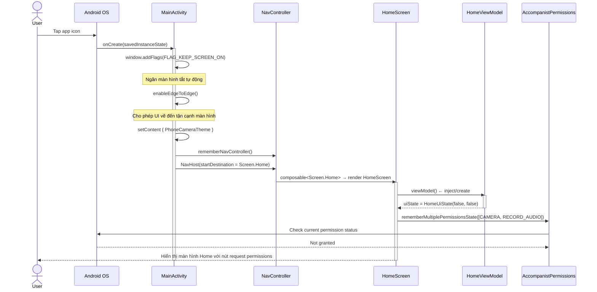
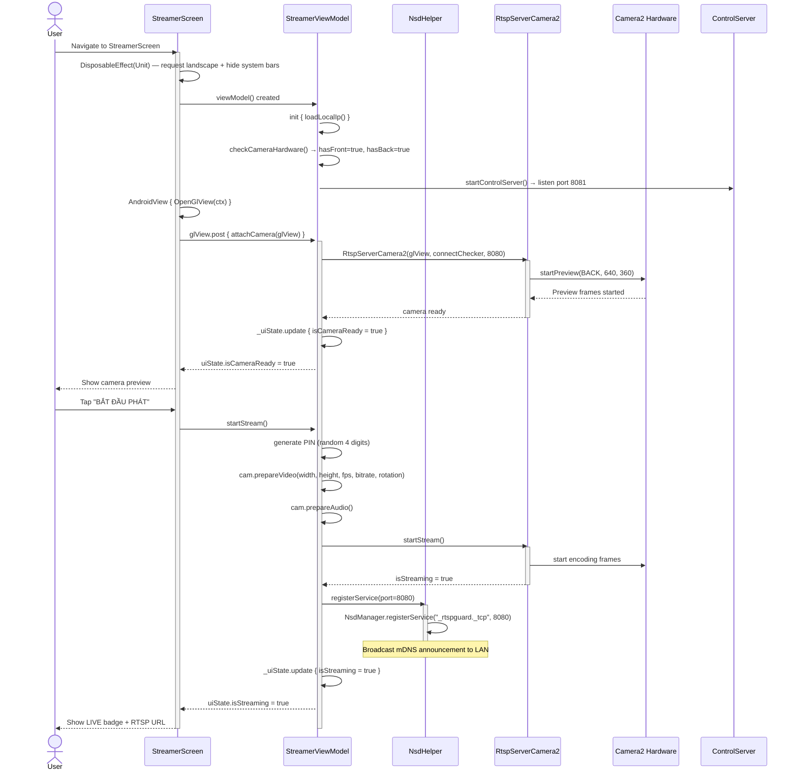
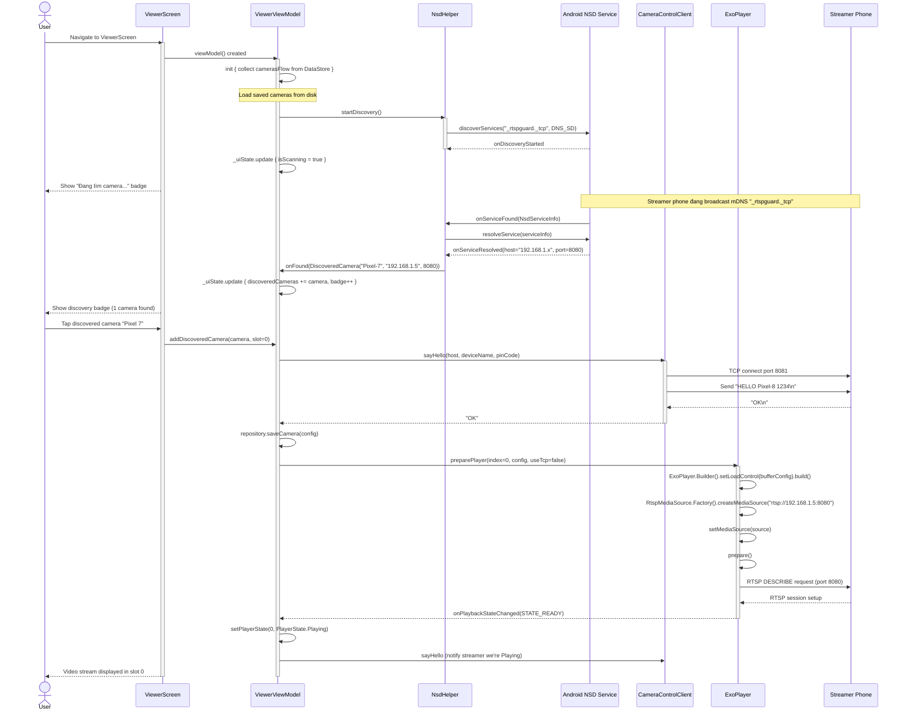
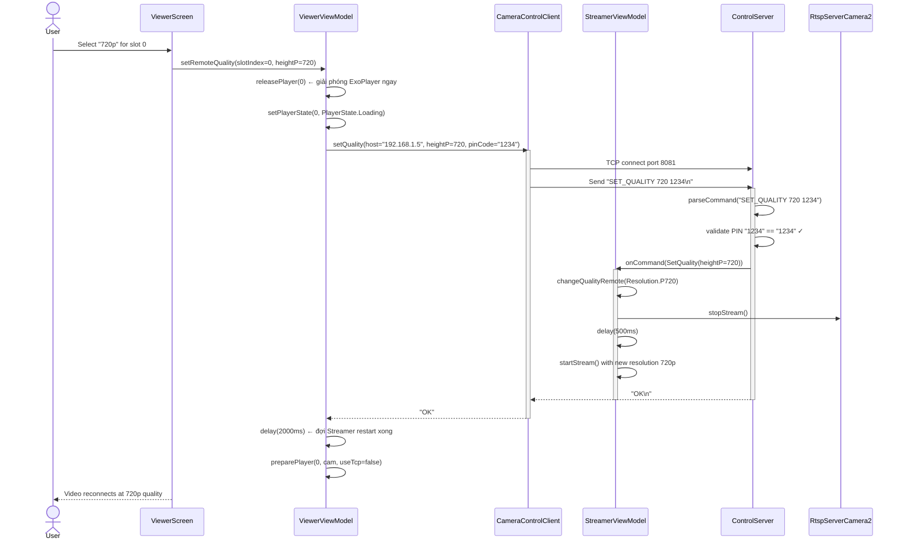
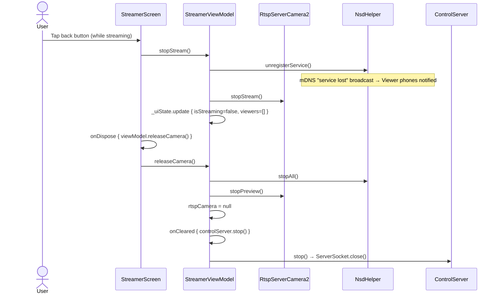

# 🔄 Sequence Diagrams — PhoneCamera

## Diagram 1: App Khởi Động (App Launch)

---

## Diagram 2: Streamer — Bắt Đầu Phát Camera

---

## Diagram 3: Viewer — Tìm và Kết Nối Camera

---

## Diagram 4: Remote Control — Viewer Đổi Chất Lượng Stream

---

## Diagram 5: Disconnect và Cleanup

