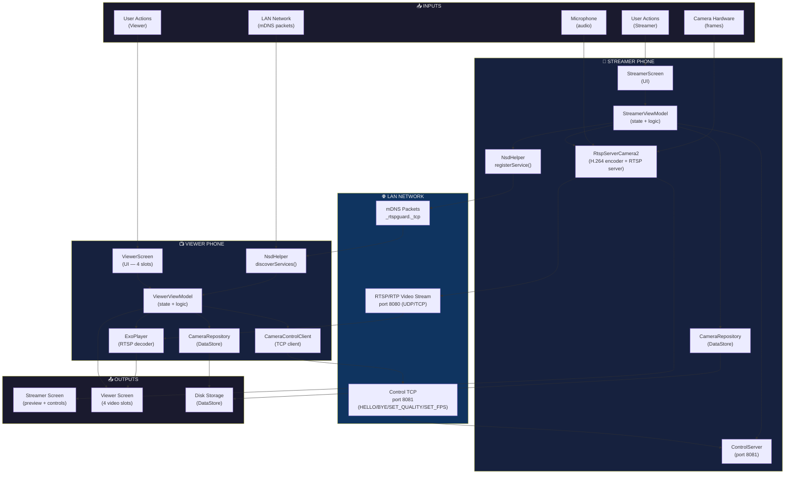
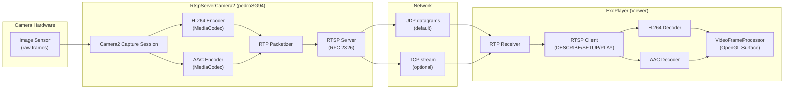
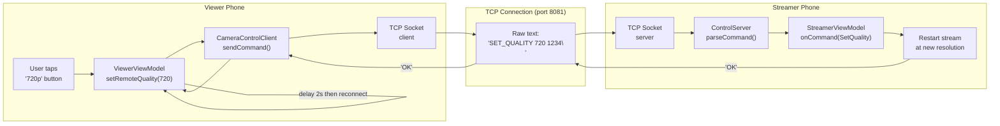

# 🔀 Data Flow Diagram — PhoneCamera

## Tổng quan Data Flow



---

## Data Flow Chi Tiết: Camera Frames



---

## Data Flow Chi Tiết: Control Commands



---

## Data Flow: DataStore Persistence

```mermaid
flowchart TD
    subgraph "App Start"
        INIT["ViewerViewModel.init()"]
        FLOW["camerasFlow.collect()"]
    end

    subgraph "DataStore (disk)"
        DS["rtsp_guard_prefs\nkey: cameras_json\nvalue: JSON string"]
    end

    subgraph "JSON"
        JSON["[{id:0, name:'Pixel7',\nhost:'192.168.1.5',\nport:8080, isPhoneCamera:true}]"]
    end

    subgraph "In-Memory State"
        SLOTS["List<CameraConfig?>\n[cam0, cam1, null, null]"]
        PLAYER["ExoPlayer instances\nmap[0]=player0\nmap[1]=player1"]
    end

    INIT --> FLOW
    FLOW --> DS
    DS --> JSON
    JSON --> SLOTS
    SLOTS --> PLAYER

    subgraph "On Save Camera"
        SAVE["repository.saveCamera(config)"]
        ENCODE["Json.encodeToString(list)"]
        WRITE["dataStore.edit { prefs[key] = json }"]
    end

    SAVE --> ENCODE
    ENCODE --> WRITE
    WRITE --> DS
```
