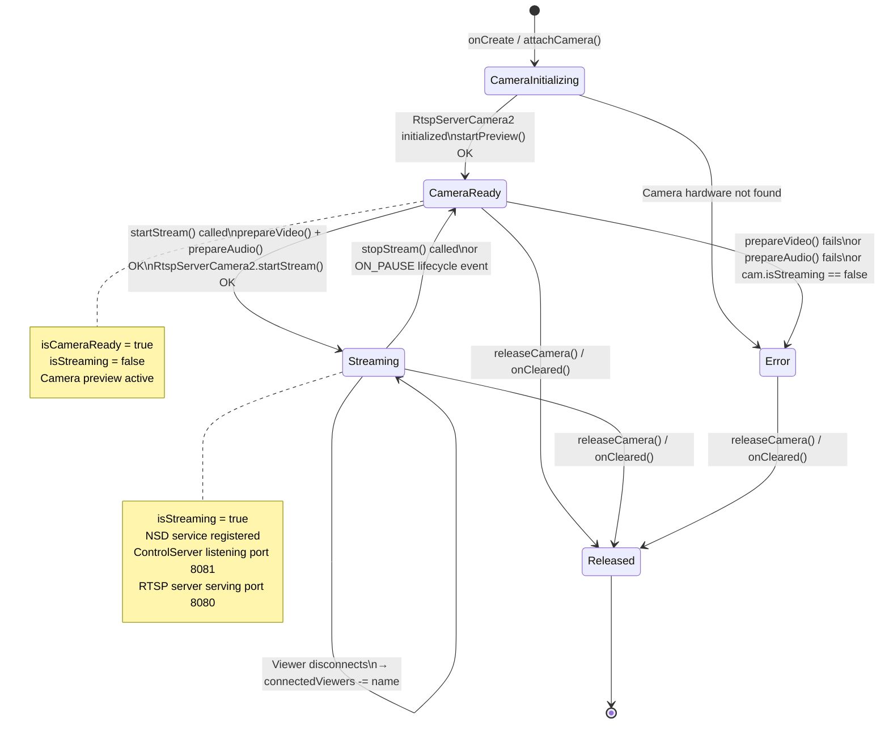
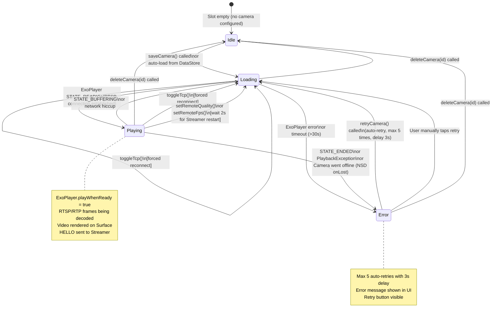
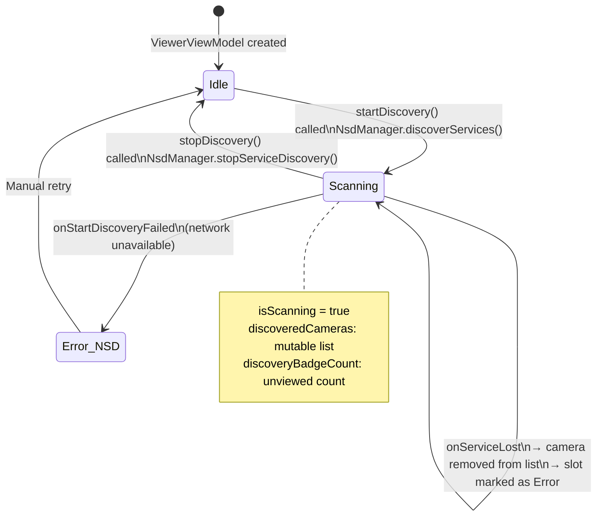
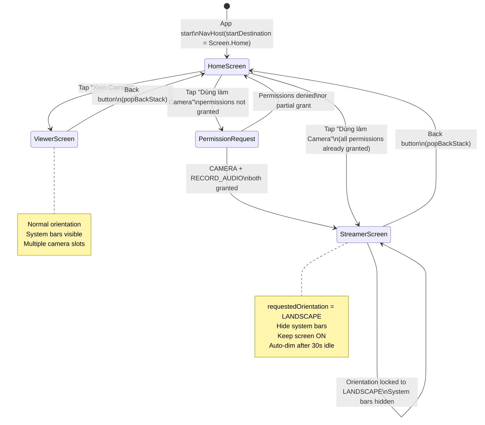
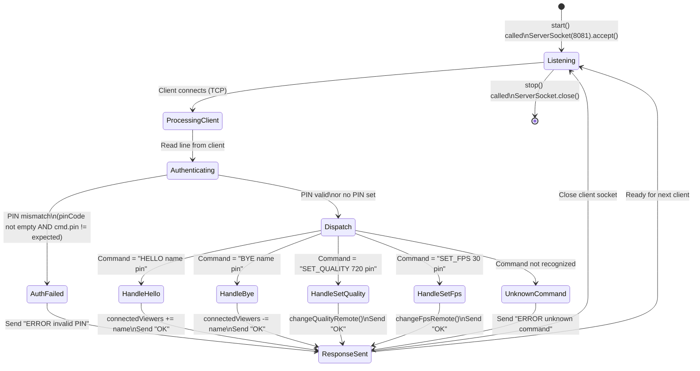

# 🔁 State Diagrams — PhoneCamera

## State Diagram 1: StreamerViewModel UI State

---

## State Diagram 2: ViewerViewModel — Player State (per slot)

---

## State Diagram 3: NSD Discovery State (Viewer side)

---

## State Diagram 4: Screen Navigation State

---

## State Diagram 5: ControlServer Command Handling

