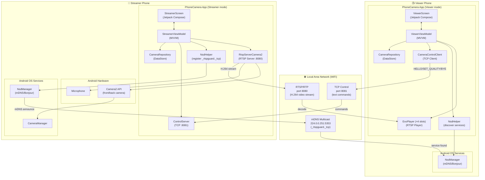
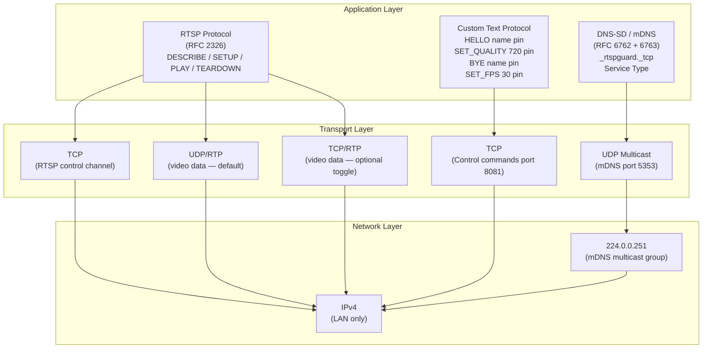
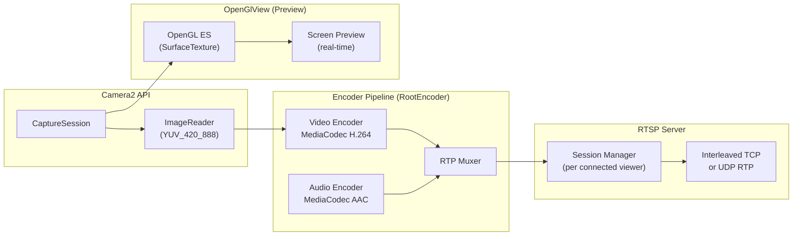
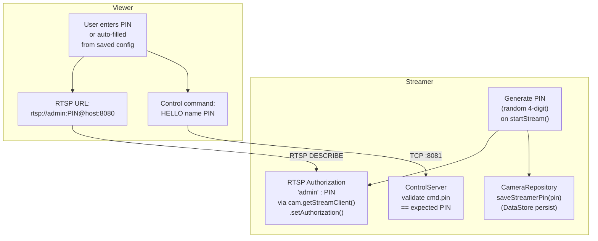
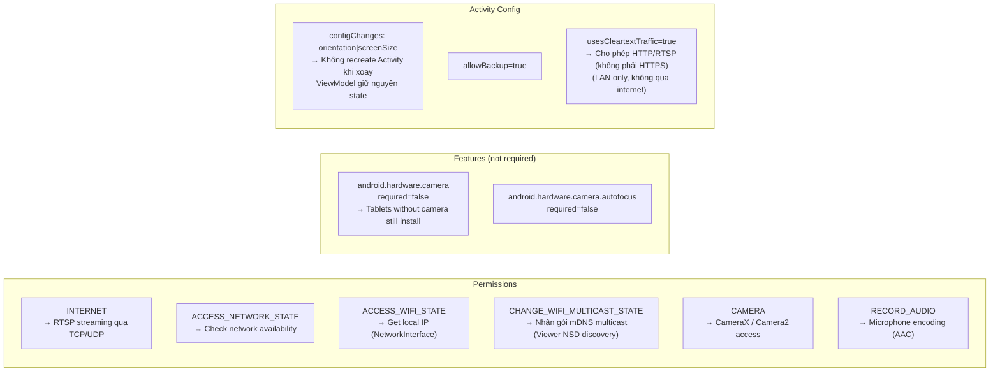

# 🧩 Component Diagram — PhoneCamera

## Tổng quan Component Interaction (2 điện thoại)

---

## Component: Network Protocol Stack

---

## Component: RtspServerCamera2 Internal Pipeline

---

## Component: Authentication Flow

---

## Manifest & Permissions Breakdown

