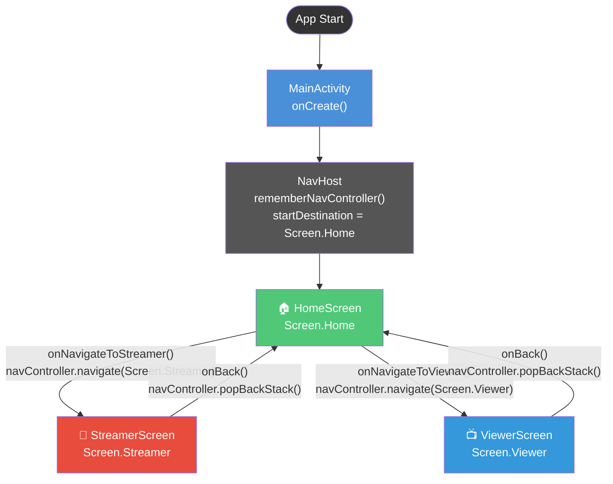
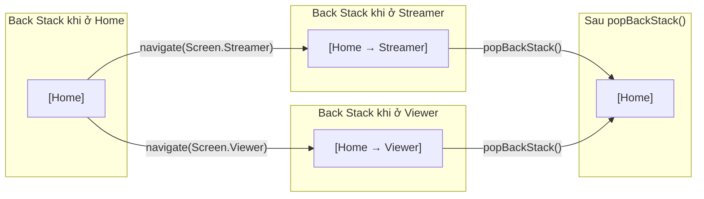
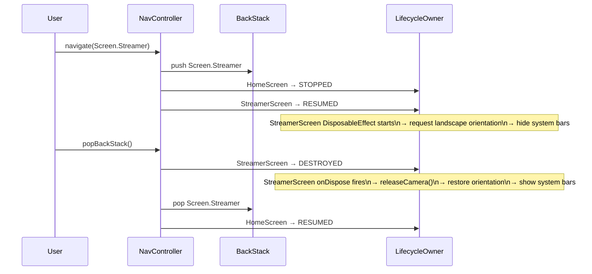

# 🗺️ Navigation Graph — PhoneCamera

## Navigation Flow Diagram



---

## Screen Definitions

### `Screen.kt` — Type-safe Navigation Routes

```kotlin
sealed interface Screen {
    @Serializable data object Home : Screen      // route: com.example.phonecamera.navigation.Screen.Home
    @Serializable data object Streamer : Screen  // route: com.example.phonecamera.navigation.Screen.Streamer
    @Serializable data object Viewer : Screen    // route: com.example.phonecamera.navigation.Screen.Viewer
}
```

> **Tại sao dùng `@Serializable` sealed interface thay vì String?**
> Navigation Compose 2.8+ hỗ trợ type-safe navigation. Dùng object thay vì String "home" giúp:
> - Compile-time safety — không typo trong route string
> - Không cần hardcode string constants
> - Arguments truyền qua navigation được type-check tại compile time

---

## Navigation Back Stack Visualization



---

## Điểm đặc biệt của Navigation trong project này

| Điểm | Chi tiết |
|------|---------|
| **Single Activity** | Toàn bộ app trong 1 `MainActivity` — không có Fragment, chỉ dùng Composable |
| **Type-safe routes** | `Screen` là sealed interface với `@Serializable` — Navigation 2.8+ feature |
| **No arguments** | Các màn hình không cần truyền data qua navigation arguments (data được lấy từ ViewModel/DataStore) |
| **Back handling** | `onBack` lambda được pass vào Screen — `popBackStack()` quay về màn hình trước |
| **Lifecycle aware** | Khi navigate away từ StreamerScreen → `onDispose` được gọi → `releaseCamera()` tự động |

---

## Navigation Events & Side Effects


